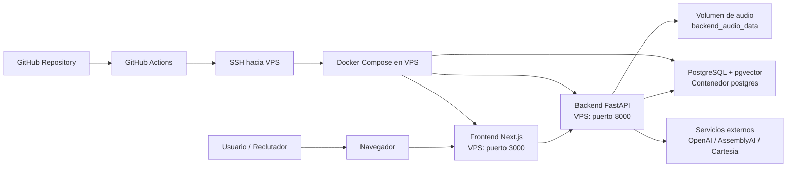
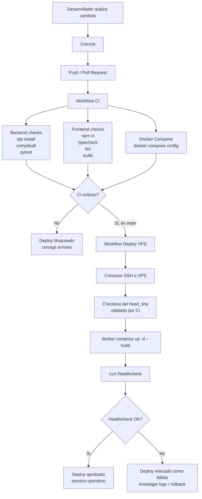
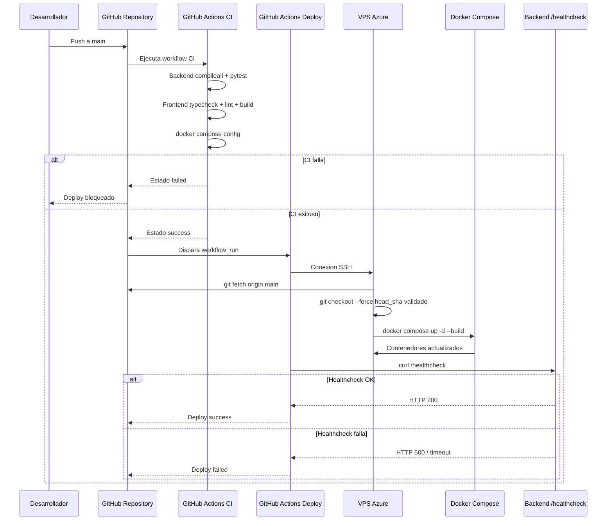
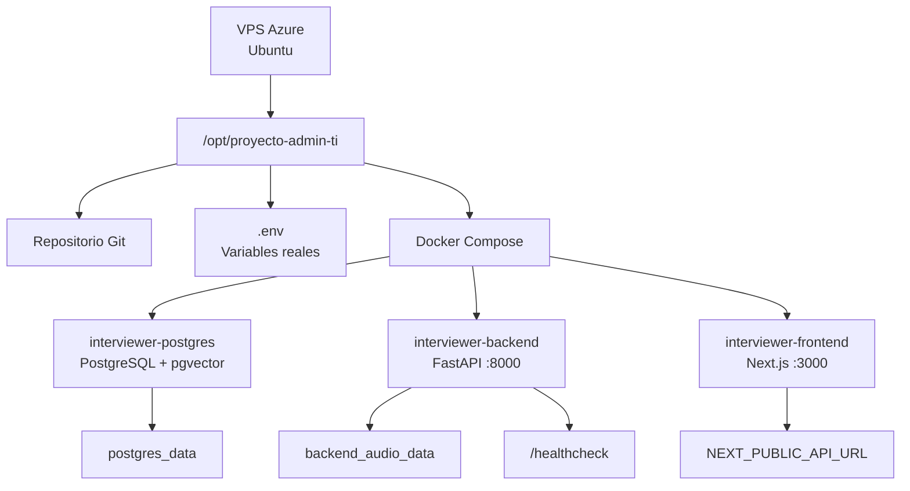

# AI Technical Interviewer Voice System

Plataforma full stack para entrevistas técnicas asistidas por IA con evaluación por plantilla, análisis de CV y entrevista por voz.

## Proposito
El presente documento y proyecto describe como esta organizado el proyecto desde una perspectiva administrativa y operativa, con enfasis en el flujo de CI/CD, los controles previos al despliegue y el procedimiento automatizado hacia la VPS.

El objetivo operativo principal es evitar que codigo defectuoso o configuraciones incorrectas lleguen automaticamente a produccion.

## Estructura General del Proyecto

```mermaid
flowchart TB
    repo["Proyecto-Admin-TI"]

    repo --> frontend["frontend/"]
    repo --> backend["backend/"]
    repo --> workflows[".github/workflows/"]
    repo --> compose["docker-compose.yml<br/>docker-compose.prod.yml"]
    repo --> docs["docs/"]
    repo --> scripts["scripts/"]
    repo --> terraform["terraform/"]

    frontend --> next["Next.js 15<br/>React + TypeScript"]
    frontend --> ui["Componentes UI"]
    frontend --> apiClient["Cliente API<br/>frontend/lib/api.ts"]

    backend --> fastapi["FastAPI<br/>backend/app/main.py"]
    backend --> routes["Rutas REST<br/>backend/app/api/routes/"]
    backend --> services["Servicios de negocio<br/>backend/app/services/"]
    backend --> repos["Repositorios<br/>backend/app/repositories/"]
    backend --> models["Modelos SQLAlchemy<br/>backend/app/models/"]
    backend --> db["Sesion DB<br/>backend/app/db/session.py"]
    backend --> tests["Pruebas<br/>backend/tests/"]

    workflows --> ci["ci.yml<br/>Validacion"]
    workflows --> cd["deploy.yml<br/>Deploy VPS"]

    compose --> postgres["postgres<br/>pgvector"]
    compose --> backendContainer["backend<br/>FastAPI"]
    compose --> frontendContainer["frontend<br/>Next.js"]

    terraform --> iac["Infraestructura de referencia<br/>Azure VM / red / NSG"]
    scripts --> backup["backup.sh"]
    scripts --> restore["restore.sh"]
```



## Arquitectura Operativa




## Resumen Ejecutivo
El proyecto es una aplicacion full stack compuesta por:

- Frontend en Next.js.
- Backend en FastAPI.
- Base de datos PostgreSQL con pgvector.
- Contenedores Docker administrados con Docker Compose.
- Despliegue automatizado en una VPS mediante GitHub Actions y SSH.

El flujo actual separa CI y CD:

- CI valida codigo, pruebas, build frontend y configuracion Docker Compose.
- CD solo se ejecuta si CI termina correctamente en la rama `main`.
- CD despliega exactamente el commit que fue validado por CI.
- Despues del deploy, GitHub Actions consulta `/healthcheck`.
- Si `/healthcheck` falla, el job de deploy falla y queda evidencia inmediata.

## Responsabilidades por Capa

| Capa | Ubicacion | Responsabilidad |
| --- | --- | --- |
| Frontend | `frontend/` | Interfaz de usuario, vistas administrativas, vistas de candidato y consumo del backend. |
| Backend API | `backend/app/api/` | Exposicion de endpoints REST. |
| Servicios | `backend/app/services/` | Logica de negocio, entrevistas, reportes, plantillas y procesamiento. |
| Repositorios | `backend/app/repositories/` | Acceso a datos y operaciones sobre modelos. |
| Base de datos | `backend/app/db/` | Conexion SQLAlchemy async, inicializacion de tablas y extension pgvector. |
| Modelos | `backend/app/models/` | Definicion de entidades persistentes. |
| Audio | `backend/app/audio/` | STT, TTS, almacenamiento y rutas de entrevista por voz. |
| RAG | `backend/app/rag/` | Embeddings, chunking, retrieval y vector store. |
| CI/CD | `.github/workflows/` | Validacion automatica y despliegue controlado. |
| Infraestructura | `docker-compose*.yml`, `terraform/` | Contenedores e infraestructura de referencia. |
| Operacion | `scripts/`, `docs/` | Backup, restore, guias y procedimientos. |

## Endpoints Operativos

| Endpoint | Uso | Nivel |
| --- | --- | --- |
| `/health` | Verificacion basica del backend. | Ligero / compatibilidad |
| `/healthcheck` | Verificacion estricta para operacion y deploy. | Produccion / CD |

El endpoint `/healthcheck` valida:

- Conexion activa a PostgreSQL mediante query `SELECT 1`.
- Escritura/lectura del almacenamiento de audio.
- Carga de configuracion runtime basica.

## Flujo CI/CD



## Workflow CD

Este parte del Workflow mantiene las siguiente reglas :

- El deploy no se dispara directamente por `push`.
- El deploy depende estrictamente del resultado de CI.
- Solo se despliega cuando CI termino correctamente.
Esto evita desplegar un commit distinto al que fue validado por CI.

## Diagrama del Deploy hacia VPS



## Infraestructura en VPS


## Conclusion Final 
El objetivo final de este proyecto es poder comprender lo mas cercano, el como se trabaja en un entorno real, dado a que este proyecto es academico nos permitio a cada estudiante poder evaluar y enteder mas a detalle los diferentes procesos que pasa el codigo y como tal su calidad antes de ser desplegado hacia una VPS y brindar asi una mejor experiencia a los usuarios. 


------

## Descripción del proyecto
- Frontend para reclutador y candidato.
- Backend API para gestión de entrevistas, scoring y reportes.
- Persistencia en PostgreSQL + pgvector.
- Integración con OpenAI, AssemblyAI y Cartesia.

## Arquitectura general
- `frontend/`: Next.js 15 + TypeScript.
- `backend/app/api`: rutas REST FastAPI.
- `backend/app/services`: lógica de negocio.
- `backend/app/repositories`: acceso a datos.
- `backend/app/models`: modelos SQLAlchemy.
- `backend/app/rag`: embeddings/retrieval con pgvector.
- `backend/app/audio`: STT/TTS y almacenamiento de audio.

## Arquitectura de infraestructura
- Docker Compose para `postgres`, `backend`, `frontend`.
- Modo desarrollo: `docker-compose.yml`.
- Modo producción: `docker-compose.yml` + `docker-compose.prod.yml`.
- IaC de referencia en `terraform/`.
- Mejora futura recomendada: Nginx reverse proxy para publicar `80/443` y ocultar `8000`.

## Servicios Docker
- `postgres` (pgvector/pg16)
- `backend` (FastAPI, puerto 8000)
- `frontend` (Next.js standalone, puerto 3000)

## Variables de entorno
Usar `.env.example` como plantilla:

```bash
cp .env.example .env
```

Variables clave:
- `OPENAI_API_KEY`
- `ASSEMBLYAI_API_KEY`
- `CARTESIA_API_KEY`
- `CARTESIA_VOICE_ID`
- `DATABASE_URL`
- `NEXT_PUBLIC_API_URL`
- `PUBLIC_BACKEND_URL`
- `BACKEND_CORS_ORIGINS`
- `AUDIO_STORAGE_DIR`

## Ejecución local
```bash
docker compose up --build
```

Accesos:
- Frontend: `http://localhost:3000`
- Backend: `http://localhost:8000`
- API docs: `http://localhost:8000/docs`

## Despliegue en VPS
Guía completa en:
- `docs/deploy-vps.md`

Comando de producción recomendado:
```bash
docker compose -f docker-compose.yml -f docker-compose.prod.yml up -d --build
```

## CI/CD
Workflows:
- `/.github/workflows/ci.yml`: validación backend/frontend y `docker compose config`.
- `/.github/workflows/deploy.yml`: despliegue por SSH a VPS en push a `main` o manual.


## Terraform / IaC
Carpeta:
- `terraform/`

Incluye recursos Azure mínimos: RG, red, subnet, IP pública, NSG, NIC y VM Linux.

Ver:
- `terraform/README.md`

## Persistencia
- Base de datos: volumen `postgres_data`.
- Audio: `backend/storage/audio` (en prod con volumen dedicado).
- Estado de workflow y embeddings en PostgreSQL.

## Backup y continuidad
Scripts:
- `scripts/backup.sh`
- `scripts/restore.sh`

Documento operativo:
- `docs/backup.md`

## Operación básica
```bash
docker ps
docker compose logs -f --tail=100
docker compose restart backend frontend
docker compose down
```

Actualizar despliegue:
```bash
git pull origin main
docker compose -f docker-compose.yml -f docker-compose.prod.yml up -d --build
docker image prune -f
```

## Troubleshooting
- Error de credenciales TTS/STT/LLM: revisar `.env`.
- CORS: ajustar `BACKEND_CORS_ORIGINS`.
- Reinicio limpio de contenedores:
  ```bash
  docker compose down
  docker compose up --build
  ```

## Evidencia para rúbrica
- Checklist presentación: `docs/checklist-presentacion.md`
- Matriz de cumplimiento: `docs/rubrica-cumplimiento.md`
- Guía VPS: `docs/deploy-vps.md`
- CI/CD: `.github/workflows/*` y `docs/github-actions.md`
- IaC: `terraform/*`
- Backup: `scripts/*` y `docs/backup.md`


